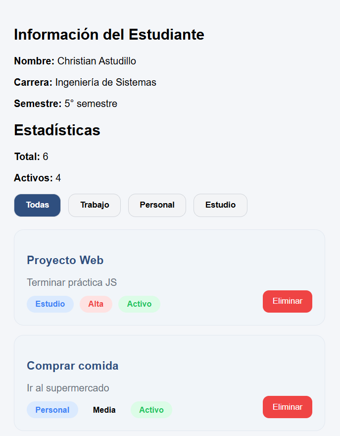
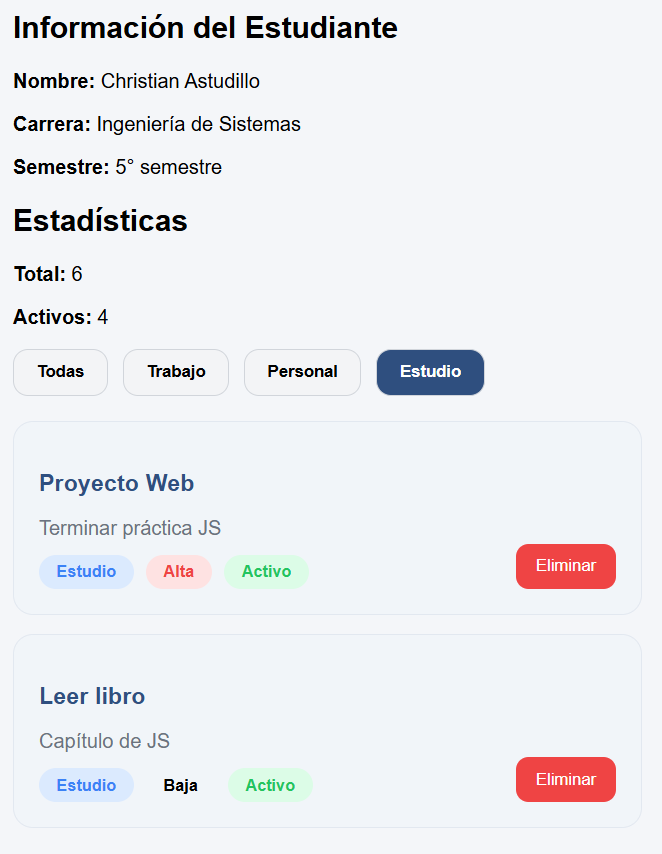

#  Práctica DOM

##  Descripción de la solución

Este proyecto consiste en una aplicación web que permite mostrar una lista de actividades organizadas por categorías como *Trabajo, Personal y Estudio*.

La aplicación utiliza **JavaScript y manipulación del DOM** para crear dinámicamente tarjetas que contienen información como el título, descripción, categoría, prioridad y estado de cada elemento.

Además, incluye:

* Filtros por categoría
* Eliminación de elementos
* Visualización de estadísticas básicas

---

## Código

###  CSS 

```css id="css-completo"
/* FONDO */
body {
    background: #f4f6f9;
    font-family: Arial;
    padding: 20px;
}

/* FILTROS */
.filtros {
    display: flex;
    gap: 12px;
    margin-bottom: 20px;
}

.btn-filtro {
    padding: 10px 18px;
    border-radius: 12px;
    border: 1px solid #d1d5db;
    background: #f3f4f6;
    cursor: pointer;
    font-weight: bold;
}

.btn-filtro-activo {
    background: #2f4f7f;
    color: white;
}

/* TARJETA */
.card {
    background: #f1f5f9;
    border-radius: 16px;
    padding: 20px;
    margin-bottom: 15px;
    border: 1px solid #e2e8f0;
    position: relative;
}

/* TEXTO */
.card h3 {
    color: #2f4f7f;
    margin-bottom: 5px;
}

.card p {
    color: #6b7280;
    margin-bottom: 12px;
}

/* BADGES */
.badges {
    display: flex;
    gap: 10px;
}

.badge {
    padding: 6px 14px;
    border-radius: 999px;
    font-size: 13px;
    font-weight: bold;
}

/* COLORES */
.badge-categoria {
    background: #dbeafe;
    color: #3b82f6;
}

.prioridad-alta {
    background: #fee2e2;
    color: #ef4444;
}

.estado-activo {
    background: #dcfce7;
    color: #22c55e;
}

/* BOTÓN */
.btn-eliminar {
    position: absolute;
    right: 20px;
    bottom: 20px;
    background: #ef4444;
    color: white;
    border: none;
    padding: 10px 16px;
    border-radius: 10px;
    cursor: pointer;
}
```

---


##  Imágenes 

###  Vista general



###  Filtros por categoría




---
