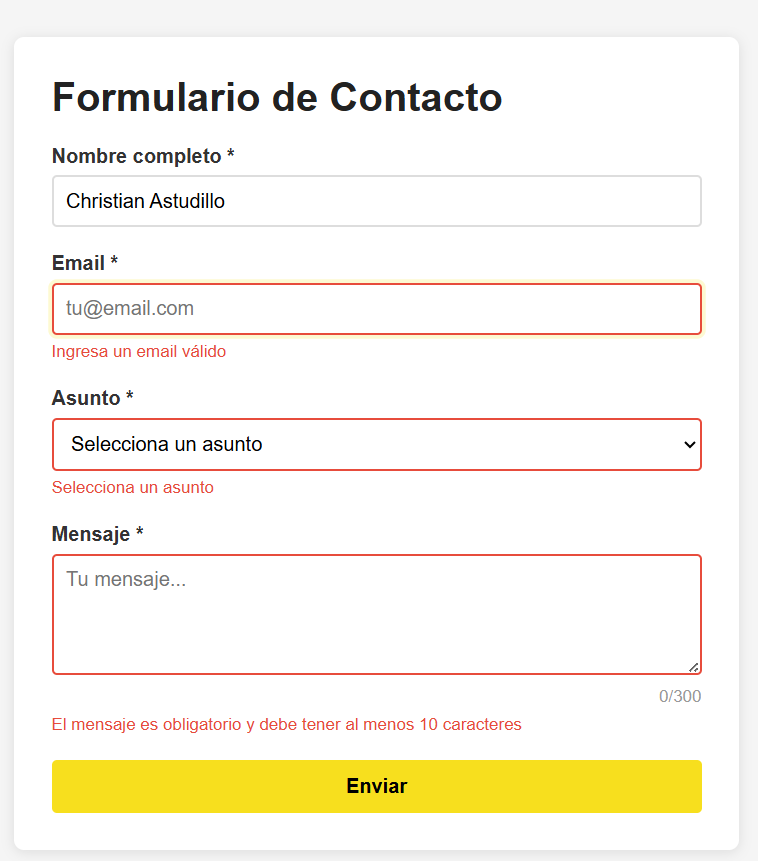
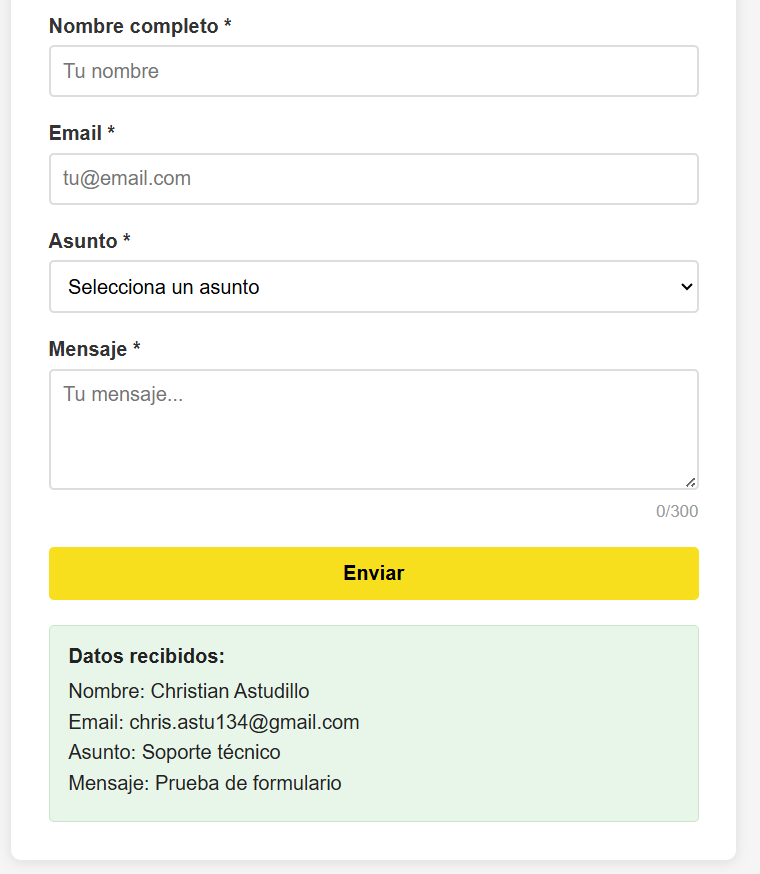
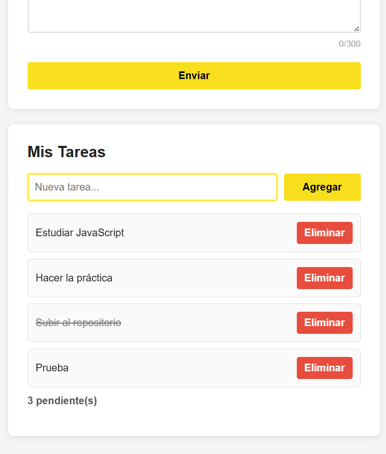
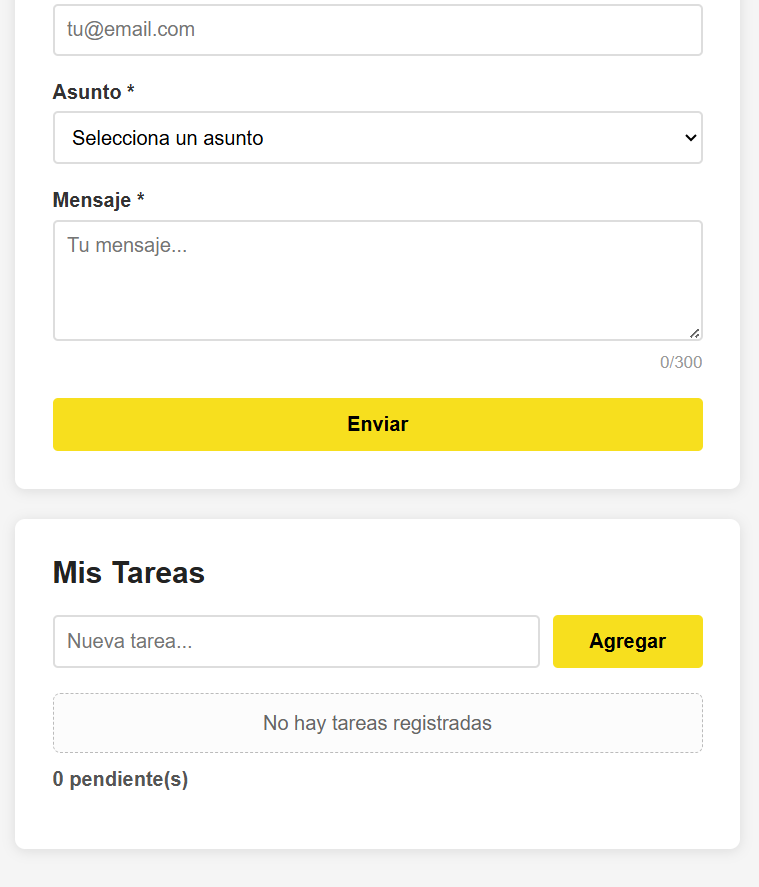

#  Eventos en JavaScript

##  Descripción

Este proyecto consiste en el desarrollo de una aplicación web interactiva utilizando **HTML, CSS y JavaScript**, enfocada en el manejo de **eventos del DOM**.

La aplicación incluye dos funcionalidades principales:

*  **Formulario de contacto** con validación en tiempo real
*  **Lista de tareas (To-Do List)** con manipulación dinámica del DOM

El objetivo es aplicar conceptos como:

* Validación de formularios
* Delegación de eventos
* Manipulación del DOM
* Uso de eventos del usuario

---

##  Funcionalidades

###  Formulario

* Validación de campos obligatorios
* Validación de email con expresiones regulares
* Contador de caracteres en tiempo real
* Mensajes de error dinámicos
* Envío sin recargar la página

###  Lista de tareas

* Agregar nuevas tareas
* Marcar tareas como completadas
* Eliminar tareas
* Contador de tareas pendientes
* Manejo dinámico con delegación de eventos

---

##  Código 

###  1. Validación de formulario con preventDefault()

```js
formulario.addEventListener('submit', (e) => {
    e.preventDefault();

    const nombreValido = validarNombre();
    const emailValido = validarEmail();
    const asuntoValido = validarAsunto();
    const mensajeValido = validarMensaje();

    if (nombreValido && emailValido && asuntoValido && mensajeValido) {
        mostrarResultado();
        resetearFormulario();
        return;
    }
});
```

 **Explicación:**
Se usa `preventDefault()` para evitar que el formulario se envíe automáticamente y así poder validar los datos antes.

---

###  2. Event Delegation en la lista de tareas

```js
listaTareas.addEventListener('click', (e) => {
    const action = e.target.dataset.action;

    if (!action) return;

    const item = e.target.closest('li');
    const id = Number(item.dataset.id);

    if (action === 'eliminar') {
        tareas = tareas.filter((tarea) => tarea.id !== id);
    }

    if (action === 'toggle') {
        const tarea = tareas.find((t) => t.id === id);
        if (tarea) tarea.completada = !tarea.completada;
    }

    renderizarTareas();
});
```

 **Explicación:**
Se utiliza **delegación de eventos** para manejar múltiples elementos dinámicos desde un solo evento en el contenedor.

---

###  3. Atajo de teclado (Ctrl + Enter)

```js
document.addEventListener('keydown', (e) => {
    if (e.ctrlKey && e.key === 'Enter') {
        e.preventDefault();
        formulario.requestSubmit();
    }
});
```

 **Explicación:**
Permite enviar el formulario usando el teclado, mejorando la experiencia del usuario.

---

##  Capturas

###  Validación en acción



---

###  Formulario procesado



---

###  Event delegation funcionando



---

###  Contador de tareas actualizado


---

###  Tareas completadas



---

