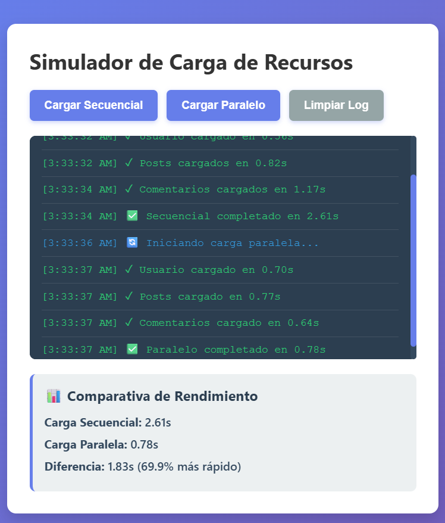
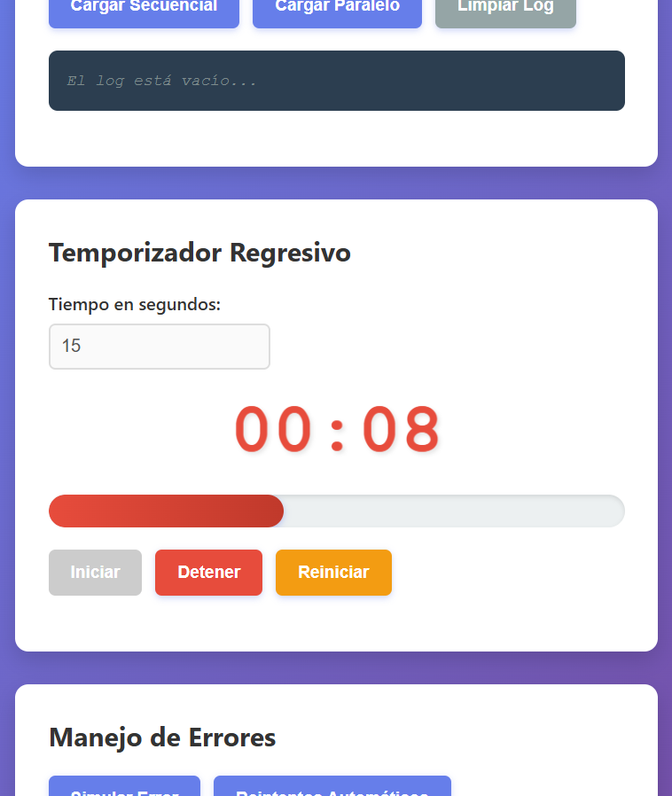

# Asincronía en JavaScript

##  Descripción del Simulador

Este proyecto consiste en un **simulador interactivo de asincronía en JavaScript**, diseñado para demostrar cómo funcionan las operaciones asíncronas en aplicaciones web.

El simulador permite:

- Ejecutar peticiones simuladas usando Promesas
- Comparar rendimiento entre ejecución secuencial y paralela
- Visualizar resultados en tiempo real mediante logs
- Utilizar un temporizador regresivo con barra de progreso
- Manejar errores correctamente con try/catch
- Implementar reintentos automáticos con espera progresiva

---

##  Funcionalidades

- Simulación de peticiones asincrónicas
- Comparación de tiempos de ejecución
- Visualización en consola (log dinámico)
- Temporizador interactivo
- Manejo de errores
- Reintentos automáticos

---

##  Análisis: Carga Secuencial vs Paralela

###  Carga Secuencial
- Las tareas se ejecutan una después de otra
- El tiempo total es la suma de todas las tareas
- Es más lenta

###  Carga Paralela
- Las tareas se ejecutan al mismo tiempo
- El tiempo total depende de la tarea más lenta
- Es más rápida


---

#  Código Destacado

```javascript
function simularPeticion(nombre, tiempoMin = 500, tiempoMax = 2000, fallar = false) {
  return new Promise((resolve, reject) => {
    const tiempoDelay = Math.floor(Math.random() * (tiempoMax - tiempoMin + 1)) + tiempoMin;

    setTimeout(() => {
      if (fallar) {
        reject(new Error(`Error al cargar ${nombre}`));
      } else {
        resolve({
          nombre,
          tiempo: tiempoDelay,
          timestamp: new Date().toLocaleTimeString()
        });
      }
    }, tiempoDelay);
  });
}
async function cargarSecuencial() {
  try {
    const usuario = await simularPeticion('Usuario');
    const posts = await simularPeticion('Posts');
    const comentarios = await simularPeticion('Comentarios');

    console.log(usuario, posts, comentarios);
  } catch (error) {
    console.error(error);
  }
}
async function cargarParalelo() {
  try {
    const resultados = await Promise.all([
      simularPeticion('Usuario'),
      simularPeticion('Posts'),
      simularPeticion('Comentarios')
    ]);

    console.log(resultados);
  } catch (error) {
    console.error(error);
  }
}
async function simularError() {
  try {
    await simularPeticion('API', 500, 1000, true);
  } catch (error) {
    console.error("Error capturado:", error.message);
  }
}
let intervaloId;
let tiempoRestante = 60;

function iniciarTemporizador() {
  intervaloId = setInterval(() => {
    tiempoRestante--;
    console.log("Tiempo restante:", tiempoRestante);

    if (tiempoRestante <= 0) {
      clearInterval(intervaloId);
      console.log("Tiempo terminado");
    }
  }, 1000);
} 
```

---
#  Capturas





