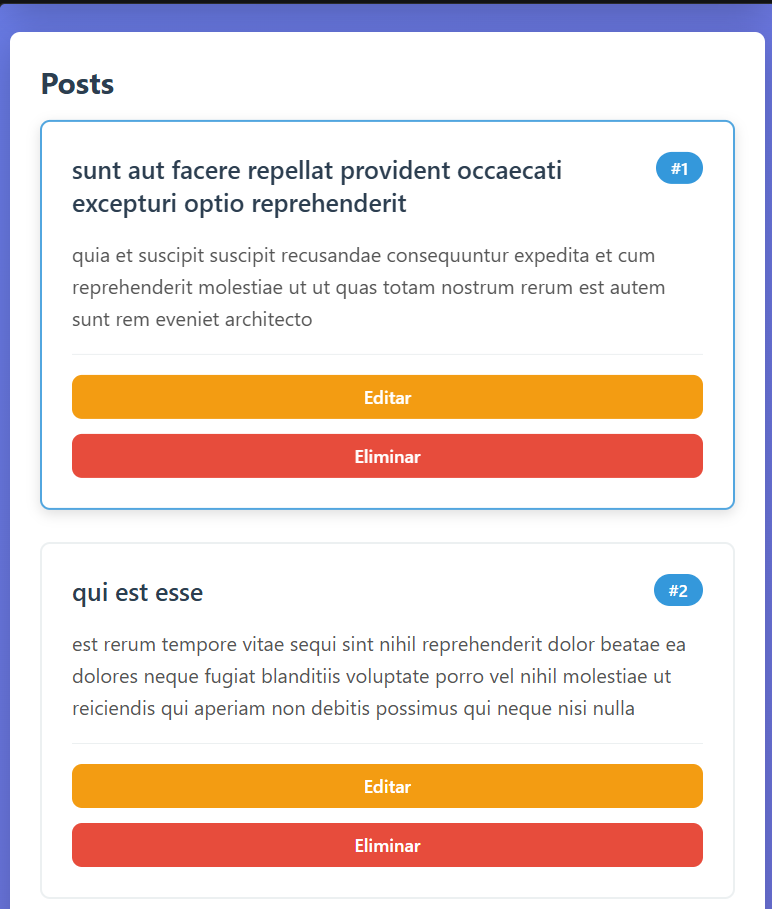
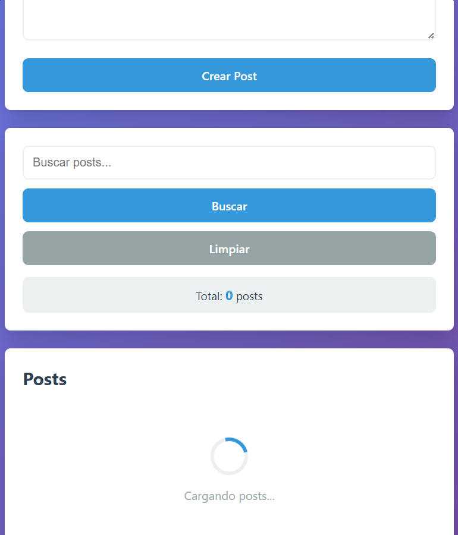
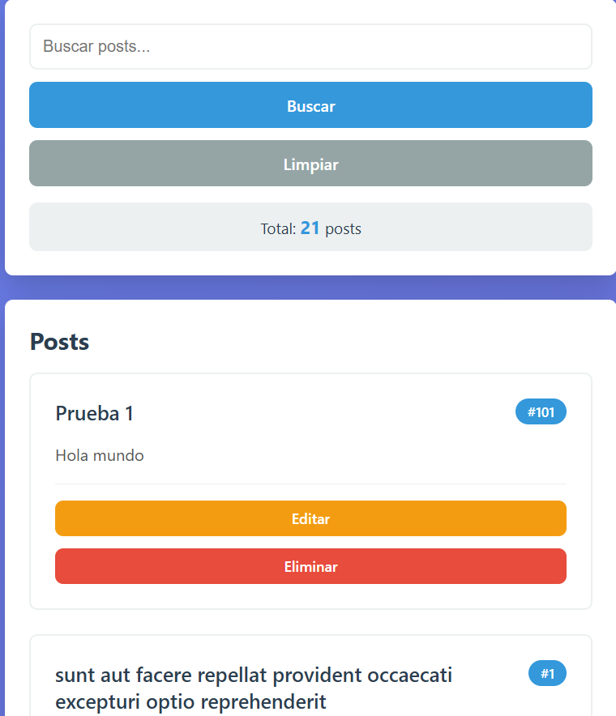
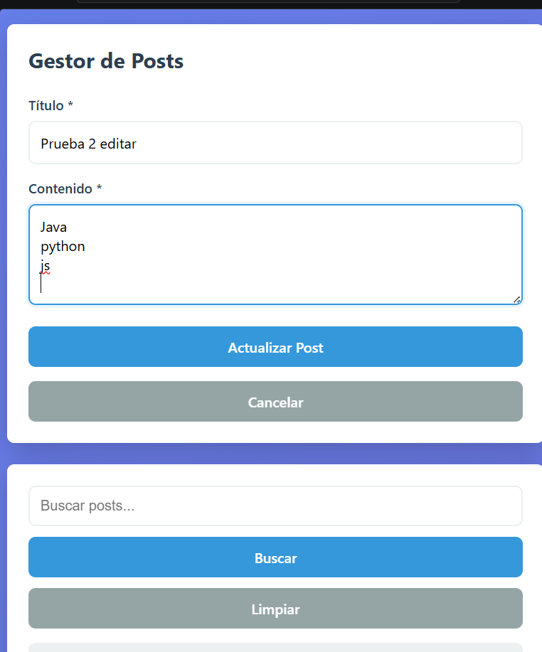
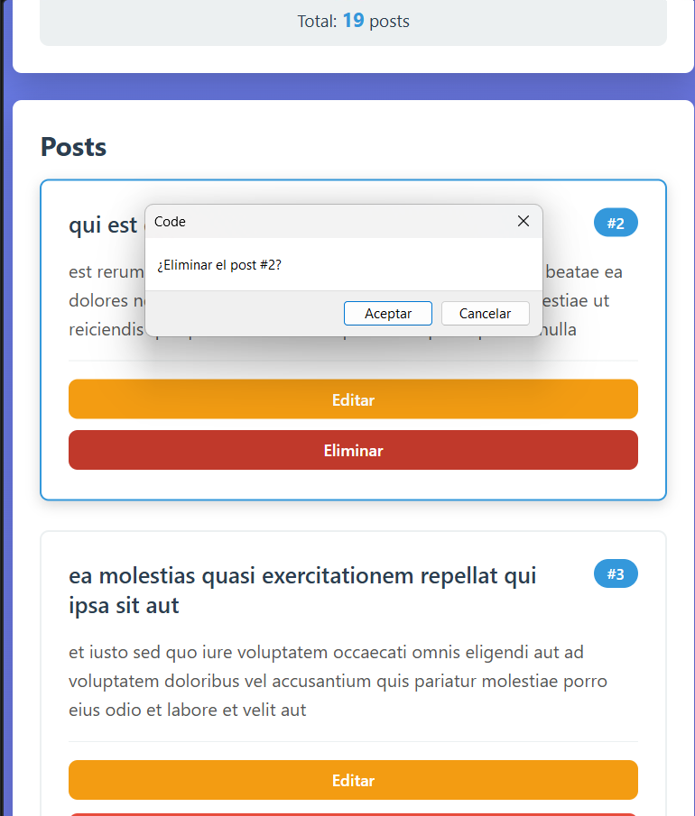
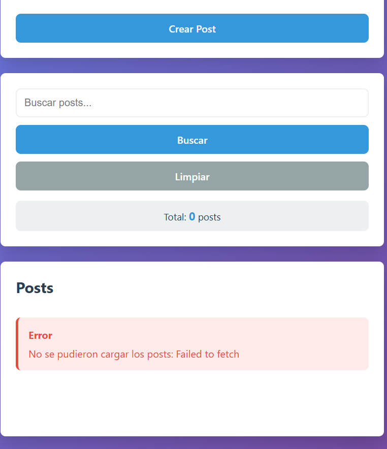

# CRUD con API (JSONPlaceholder)

## Descripción

Este proyecto consiste en una aplicación web básica que permite trabajar con posts usando una API pública. Se pueden crear, ver, editar y eliminar registros, además de buscar información dentro de ellos.

Todo está hecho con JavaScript puro, sin usar frameworks.

---

## Funcionalidades

* Mostrar posts desde una API
* Crear nuevos posts
* Editar posts existentes
* Eliminar posts
* Buscar por título o contenido
* Mostrar mensajes de carga y error

---

## Tecnologías

* HTML
* CSS
* JavaScript
* Fetch API

---

## Evidencias

### 1. Datos cargados desde la API

**Descripción:** Se cargan los posts desde la API usando una petición GET y se muestran en la página.

---

### 2. Spinner de carga

**Descripción:** Mientras se cargan los datos, se muestra un mensaje de “Cargando posts...”.

---

### 3. Crear post

**Descripción:** Se llena el formulario y se crea un nuevo post. Este aparece al inicio de la lista.

---

### 4. Editar post

**Descripción:** Se selecciona un post, se modifica su información y se actualiza.

---

### 5. Eliminar post

**Descripción:** Se elimina un post y desaparece de la lista.

---

### 6. Manejo de errores

**Descripción:** Si ocurre un error, se muestra un mensaje en pantalla.

---

## Notas

* La API usada es solo para pruebas, por eso los datos están en inglés.
* Los cambios (crear, editar, eliminar) no se guardan realmente en el servidor.
* No se usa innerHTML para evitar problemas de seguridad.

---

## Conclusión

Con este proyecto se pudo practicar el consumo de APIs, manejo del DOM y operaciones CRUD usando JavaScript.

---
