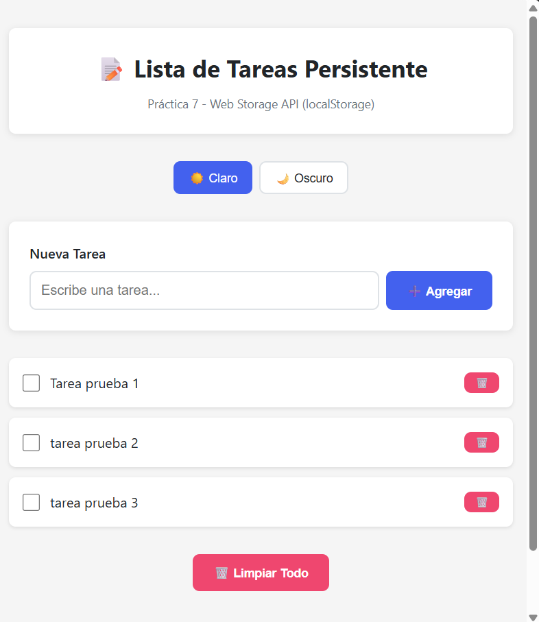
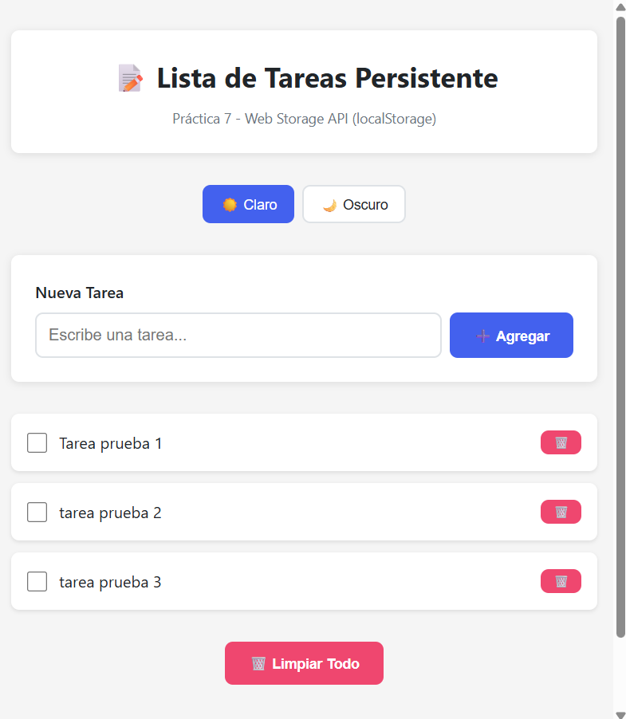
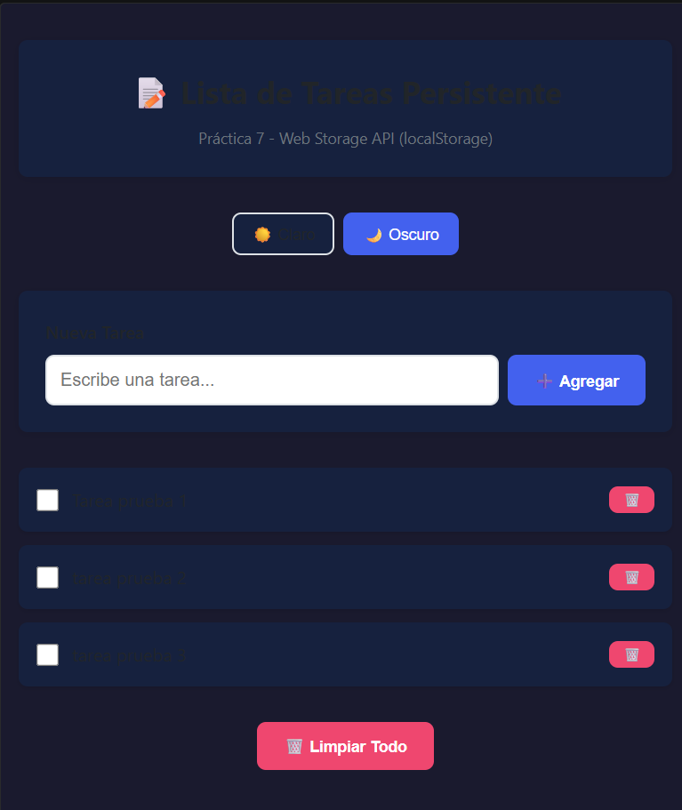
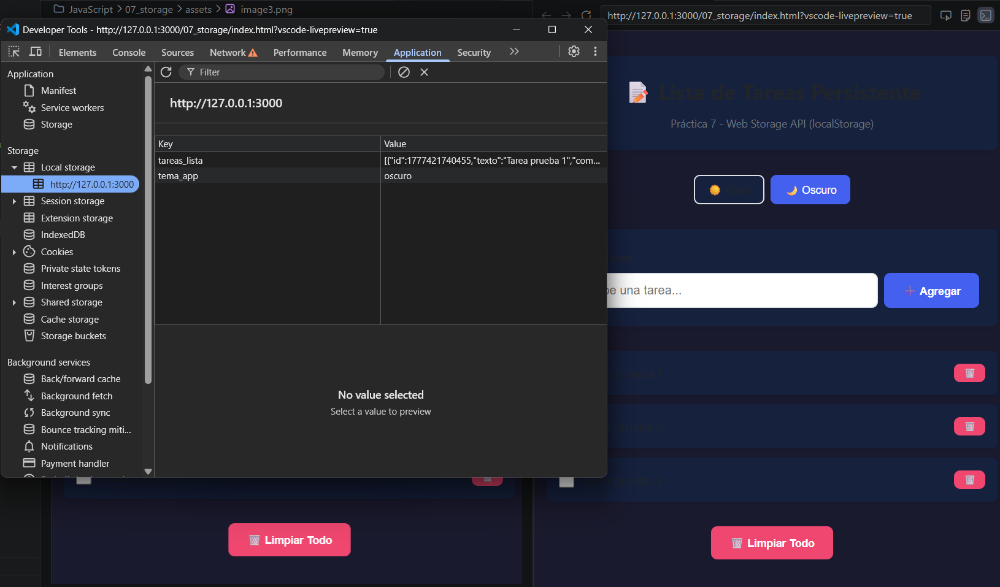

# Lista de Tareas con LocalStorage

## Descripción

Este proyecto es una aplicación web sencilla para gestionar tareas. Permite crear, marcar como completadas, eliminar tareas y mantener la información guardada usando localStorage.

También incluye un cambio de tema (claro/oscuro) que se mantiene al recargar la página.

---

## Funcionalidades

* Agregar nuevas tareas
* Marcar tareas como completadas
* Eliminar tareas
* Limpiar todas las tareas
* Persistencia con localStorage
* Cambio de tema (claro / oscuro)
* Mensajes de estado

---

## Tecnologías

* HTML
* CSS
* JavaScript

---

## Evidencias

### 1. Lista con datos persistentes

**Descripción:** Se crean varias tareas y se muestran en la lista. Al recargar la página, las tareas siguen visibles gracias a localStorage.

---

### 2. Persistencia

**Descripción:** Se recarga la página y los datos se mantienen, demostrando que la información se guarda correctamente en el navegador.

---

### 3. Tema oscuro

**Descripción:** Se cambia al tema oscuro y se mantiene después de recargar la página.

---

### 4. DevTools - Local Storage

**Descripción:** En DevTools > Application > Local Storage se pueden ver las claves `tareas_lista` y `tema_app` con los datos guardados en formato JSON.

---

## Notas

* Se usa localStorage para guardar los datos en el navegador.
* Los datos persisten incluso después de recargar la página.
* Se evita el uso de innerHTML para contenido dinámico.
* El tema seleccionado también se guarda en localStorage.

---

## Conclusión

Este proyecto permite entender cómo almacenar datos en el navegador, manipular el DOM de forma segura y aplicar funcionalidades básicas de un CRUD sin necesidad de backend.

---
