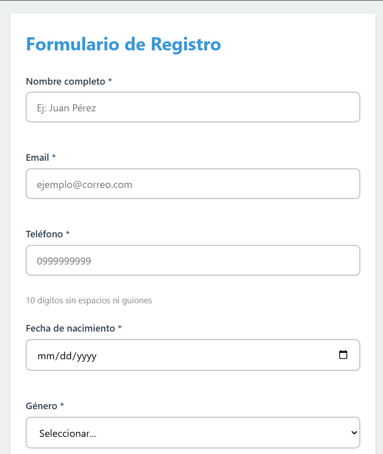
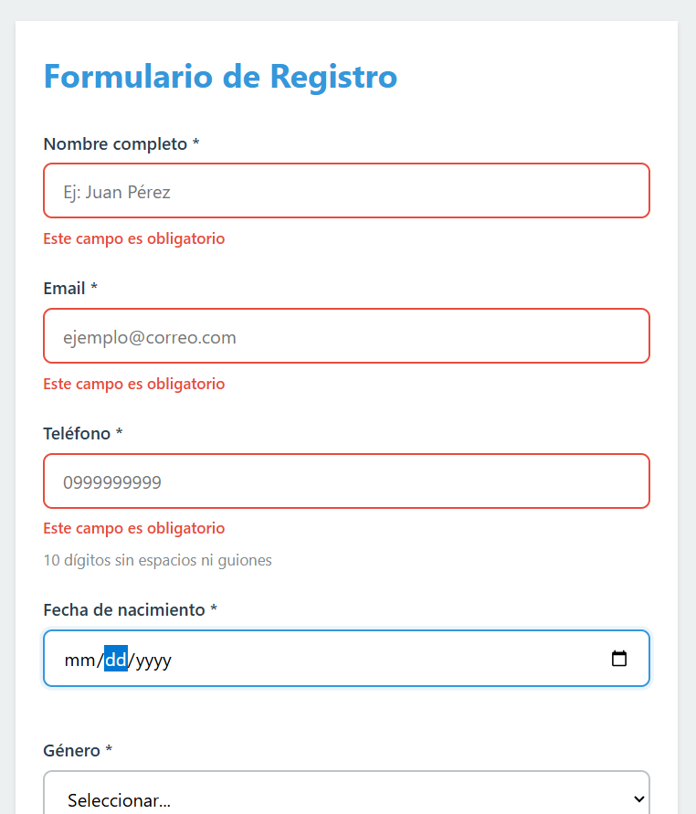
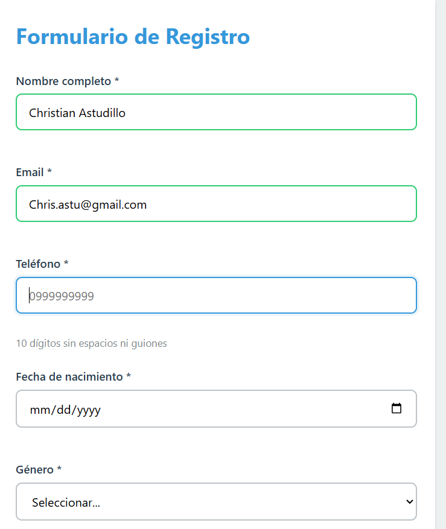
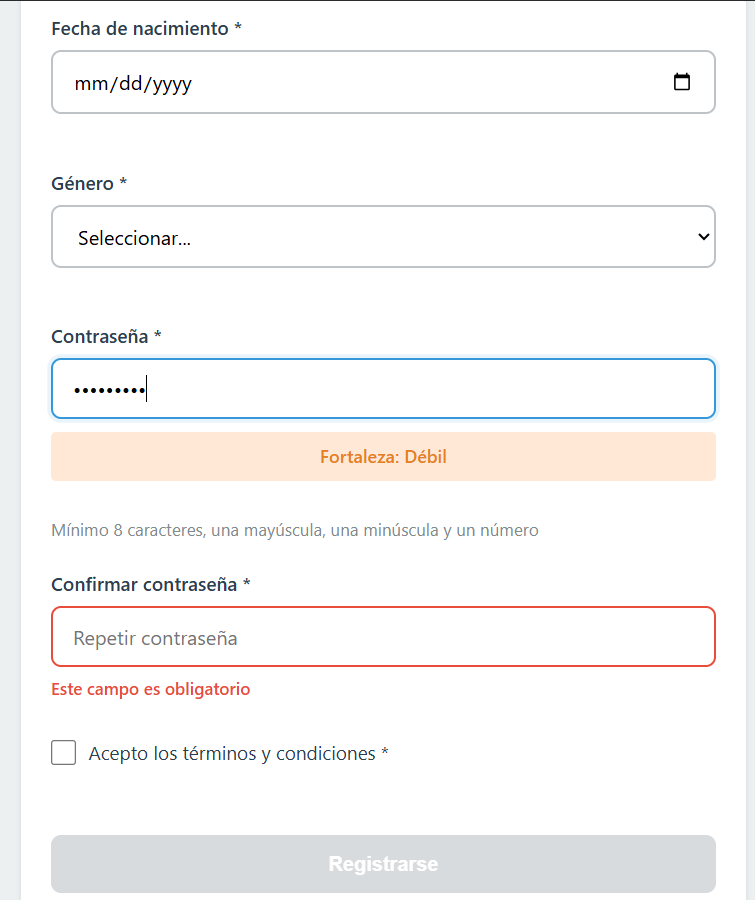
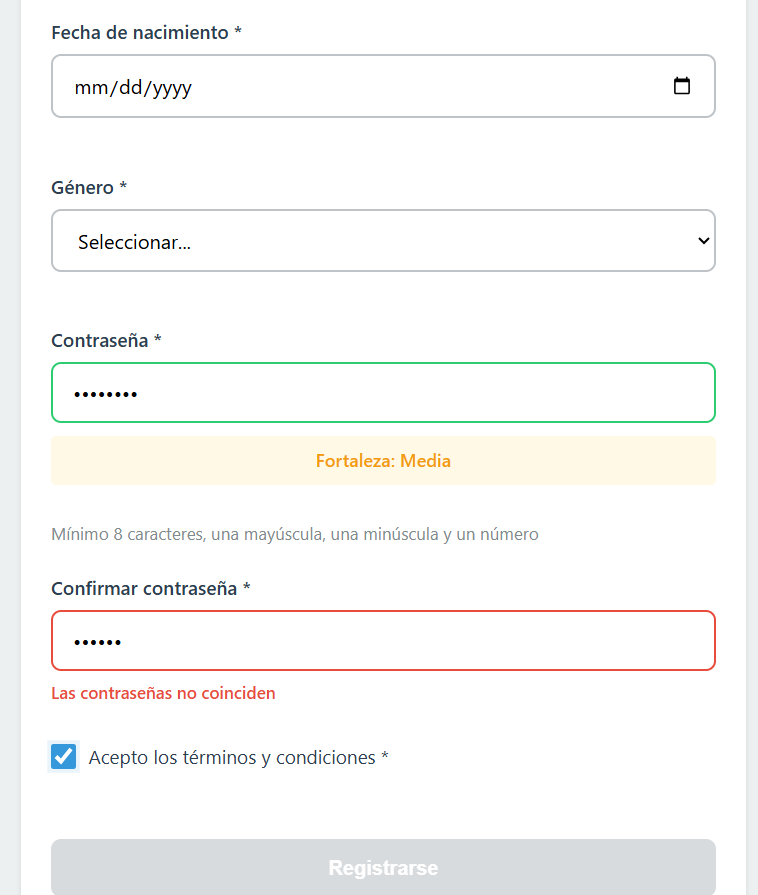
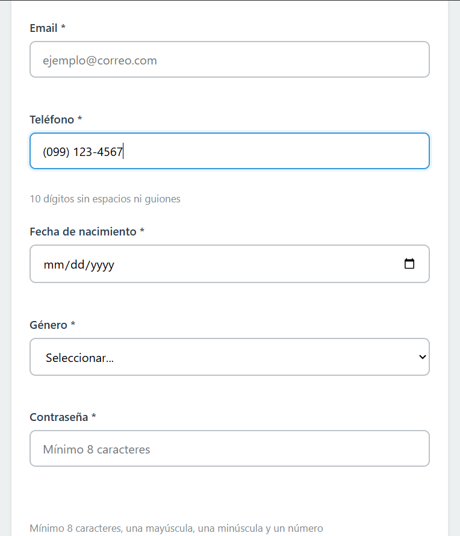
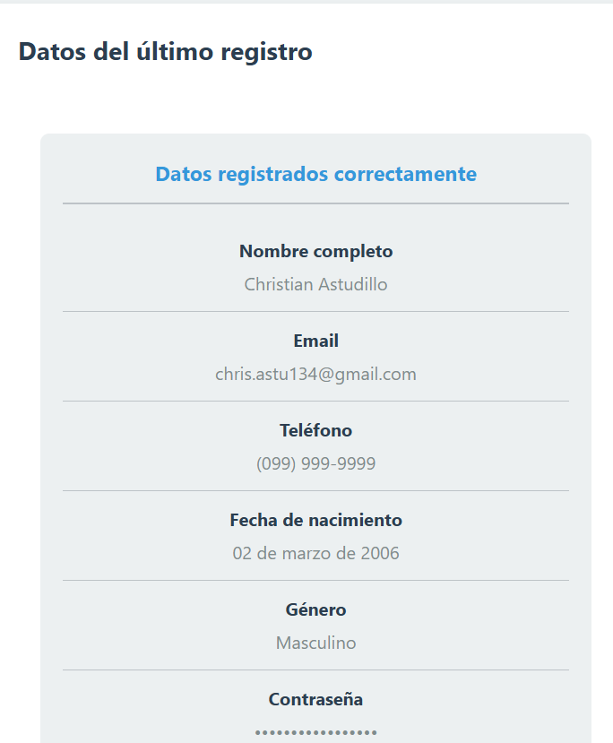
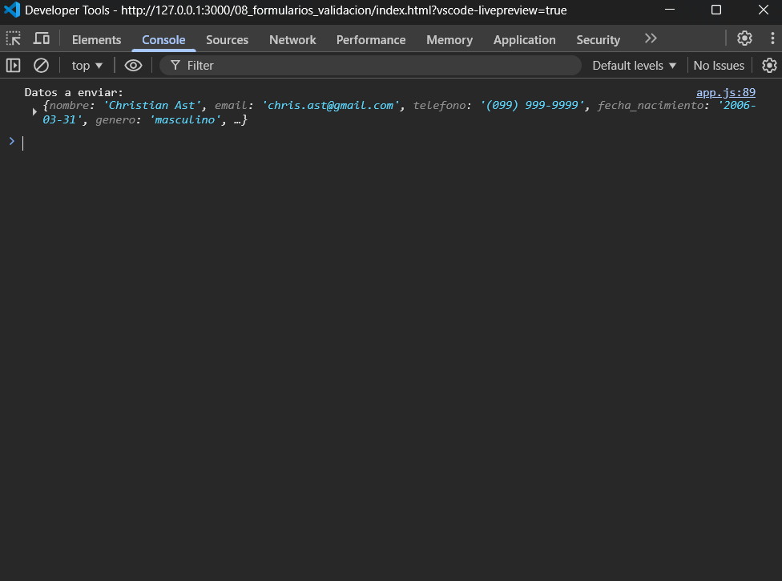

# Resultados y Evidencias - Validación de Formulario

## Capturas requeridas

- Formulario vacío con botón deshabilitado  
- Errores de validación (campos en rojo con mensajes)  
- Campos válidos (bordes verdes)  
- Indicador de fuerza de contraseña (mínimo 3 niveles)  
- Error de contraseñas no coinciden  
- Máscara de teléfono aplicada  
- Envío exitoso (mensaje verde)  
- Tarjeta con datos registrados  
- Consola mostrando los datos enviados  
- Código (validacion.js y components.js)

---

## Formato del Archivo de Evidencias

### 1. Formulario inicial
  
**Descripción:** Formulario cargado sin datos. El botón de envío está deshabilitado hasta completar los campos requeridos.

---

### 2. Errores de validación
  
**Descripción:** Se muestran múltiples campos con errores, resaltados en rojo con mensajes específicos como "campo obligatorio" o "formato inválido".

---

### 3. Campos válidos
  
**Descripción:** Campos correctamente llenados con borde verde, indicando que la validación es exitosa.

---

### 4. Indicador de fuerza de contraseña
  
**Descripción:** Se muestra el nivel de seguridad de la contraseña (débil, media, fuerte) según los criterios definidos.

---

### 5. Error en confirmación de contraseña
  
**Descripción:** Mensaje de error indicando que las contraseñas no coinciden.

---

### 6. Máscara de teléfono
  
**Descripción:** El campo teléfono aplica automáticamente el formato (099) 999-9999 mientras el usuario escribe.

---

### 7. Tarjeta de resultado
  
**Descripción:** Se muestran los datos ingresados en una tarjeta, con formato adecuado (contraseña oculta, fecha formateada, género legible).

---

### 8. Consola (DevTools)
  
**Descripción:** En la consola del navegador se imprime el objeto con todos los datos enviados.

---

## Notas

- Todas las validaciones se realizan con JavaScript puro.
- Se utiliza `createElement` para construir el DOM de forma segura.
- Las expresiones regulares validan formatos como email, teléfono y contraseña.
- El formulario no se envía si existen errores.
- Se implementa validación en tiempo real y feedback visual.